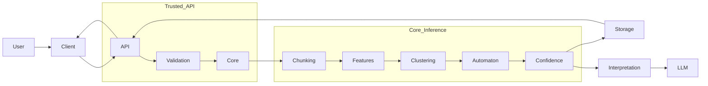

# SECURITY.md — Cortex Atlas

## Overview

Cortex Atlas is a proprietary AI system that processes sensitive written communication data.  
Security, privacy, and responsible disclosure are core requirements.

This document describes:
- How to report security vulnerabilities
- What security guarantees exist
- What is explicitly out of scope
- How security issues are handled

---

## Reporting a Vulnerability

If you discover a security vulnerability, **do not open a public issue**.

### Preferred Disclosure Method
- Email: **security@cortexatlas.ai** (replace with active address)
- Subject: **Security Disclosure — Cortex Atlas**
- Include:
  - Description of the issue
  - Steps to reproduce (if applicable)
  - Potential impact
  - Affected components or files
  - Any proof-of-concept (if available)

We aim to acknowledge receipt **within 72 hours** and provide a remediation timeline where possible.

---

## Supported Versions

Security updates apply only to:

- Latest tagged production releases
- Actively maintained branches

Experimental, archived, or research-only code under `/experiments` is **not** guaranteed to receive security fixes.

---

## Security Scope

### In Scope
- Authentication and authorization
- API access control
- Data isolation between users and organizations
- Encryption in transit and at rest
- Input handling and injection risks
- Model access controls
- Inference pipeline integrity
- Infrastructure misconfiguration
- Access to derived representations (embeddings, features)

### Explicitly Out of Scope
- User-side misconfiguration
- Social engineering attacks
- Misuse of outputs by end users
- Third-party integrations outside our control
- Inference interpretation disagreements
- Ethical misuse that does not involve a technical vulnerability

---

## Data Protection Practices

Cortex Atlas is designed with the following principles:

- **Least privilege** access to data
- **Data minimization** by default
- **No cross-organization data sharing**
- **No training on user data without explicit opt-in**
- **Derived representations prioritized over raw text retention**

Raw text is retained only as long as necessary for processing, unless explicitly configured otherwise by the user or organization.

---

## Model & AI-Specific Security

### Model Access
- Model weights and inference logic are proprietary
- Access is restricted to authorized services
- No public model endpoints exposing raw inference internals

### Prompt & Injection Safety
- Inputs are sanitized and segmented
- Interpretation layer is constrained by structural outputs
- LLMs are not trusted as sole decision-makers

### Output Safety
- Outputs are descriptive, not prescriptive
- Explicit non-claims are enforced
- Confidence and uncertainty are surfaced to reduce misuse

---

## Responsible Disclosure Policy

We support and encourage responsible disclosure.

We request that reporters:
- Avoid exploiting vulnerabilities beyond proof-of-concept
- Avoid accessing or modifying real user data
- Allow reasonable time for remediation before public disclosure

We do not currently operate a formal bug bounty program, but we may acknowledge valid disclosures.

---

## Compliance & Audits

Cortex Atlas is built to support:
- SOC 2 readiness
- GDPR and CCPA compliance
- Enterprise security reviews

Security documentation may be provided under NDA for enterprise customers.

---

## Incident Response

In the event of a confirmed security incident:
1. Impact is assessed immediately
2. Affected systems are isolated
3. Users are notified when required by law or contract
4. Remediation and postmortem are conducted
5. Preventive controls are implemented

---

## Security Updates

Security-related fixes are documented in release notes when applicable.  
Silent patches may be applied when disclosure would increase risk.

---

## Contact

Security contact:
- **security@cortexatlas.ai**

General governance or compliance inquiries:
- Refer to `DATA_USAGE.md`
- Contact the Cortex Atlas maintainers

---

## Final Note

Cortex Atlas treats security as a continuous process, not a checklist.

If you believe something is unsafe, ambiguous, or insufficiently guarded, report it.
